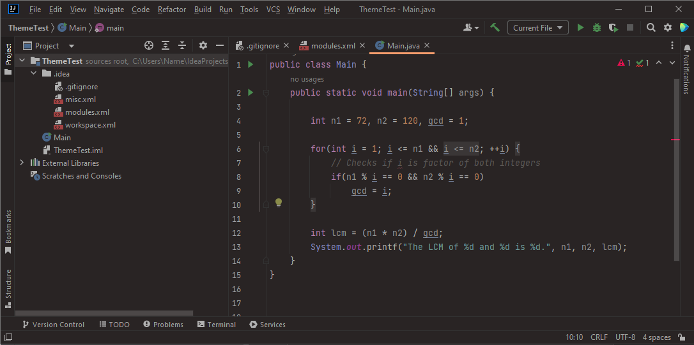

# Dark Coffee

#### with cinnamon, cats, tea, oranges and a bit of sunshine

---
<!-- Plugin description -->

- a simple modification of the dracula theme to make it darker.
- color pallet refactor in progress.
  
- inspired by warm-night theme form: https://github.com/mswift42/intellij-ui-themes

<!-- Plugin description end -->

## Installation

- Using the IDE built-in plugin system:

  <kbd>Settings/Preferences</kbd> > <kbd>Plugins</kbd> > <kbd>Marketplace</kbd> > <kbd>Search for "Dark Coffee"</kbd> >
  <kbd>Install</kbd>

- Manually:

  Download the [latest release](https://github.com/0o-Mi/Dark-Coffee-Theme/releases/latest) and install it manually
  using
  <kbd>Settings/Preferences</kbd> > <kbd>Plugins</kbd> > <kbd>⚙️</kbd> > <kbd>Install plugin from disk...</kbd>

---

