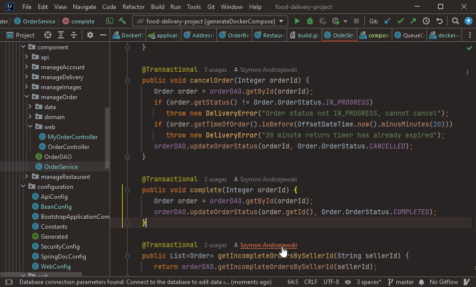
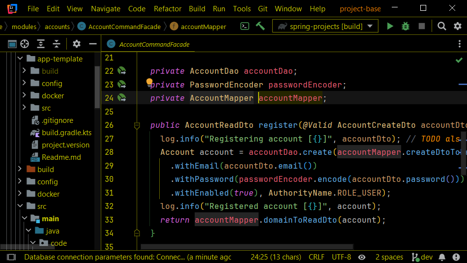

# Intellij Idea High-Contrast theme builder

## Description:

This repository contains my themes for Intellij Idea, made for the version 2024.3, old UI style. First, it contains the deprecated DarkCoffee which was created using the original guidelines for theme project. Second, there is the SunLike theme which uses a custom-made framework - the "*" global colors in theme.json, and a python .xml parser to parse {color_name} into predefined hexes.

## My Themes:

### DarkCoffee
- reddish-brown theme with soft white.
- has resuidual coloring from dracula

### SunLike
- a high-contrast black, warm colored theme.
- uses code coloring from the OneDark theme (https://plugins.jetbrains.com/plugin/11938-one-dark-theme)

---

  ## Installation

- Manually:
  Download the [latest release](https://github.com/0o-Mi/Dark-Coffee-Theme/releases/latest) and install it manually
  using
  <kbd>Settings/Preferences</kbd> > <kbd>Plugins</kbd> > <kbd>⚙️</kbd> > <kbd>Install plugin from disk...</kbd>

---
