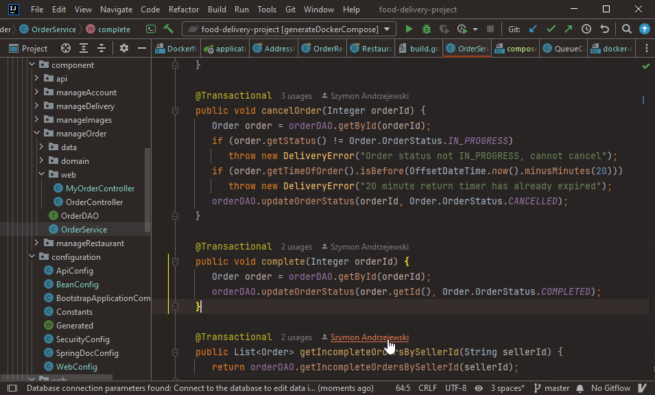

# Dark Coffee

#### with cinnamon, cats, tea, oranges and a bit of sunshine

---
#### Description:

- a modification of the dracula theme to make it reddish-orange instead of green and darker.
- some java code coloring is present
- It's usable, most of the ui components have correct colors - let me know if something is missing
- inspired by warm-night theme form: https://github.com/mswift42/intellij-ui-themes

___

#### known issues: 

- inactive window "bar" color is sometimes white

Due to the pain of making themes in xml (no docs and a ton of variables referring to the same thing) fixing has been put on hold.
## Installation

- Manually:
  Download the [latest release](https://github.com/0o-Mi/Dark-Coffee-Theme/releases/latest) and install it manually
  using
  <kbd>Settings/Preferences</kbd> > <kbd>Plugins</kbd> > <kbd>⚙️</kbd> > <kbd>Install plugin from disk...</kbd>

---